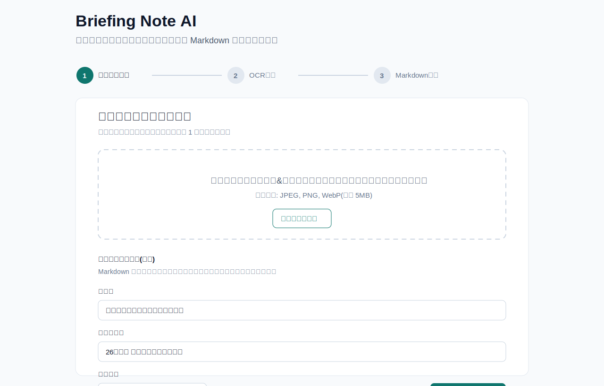
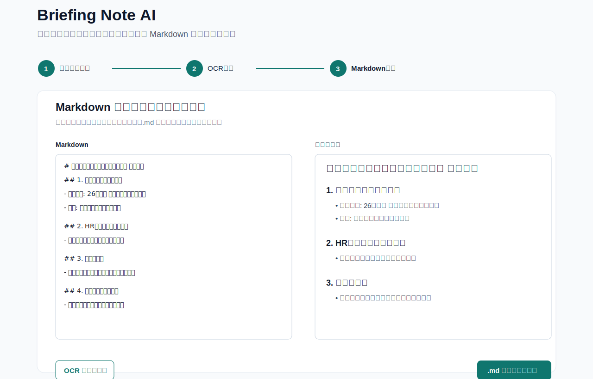

# briefing-note-ai

紙の企業説明会メモを OCR/LLM で構造化 Markdown に変換し、就活の企業研究・ES・面接対策に再利用できるようにする Web アプリです。

## Status

現在は Docker 開発環境構築フェーズです。OCR、OpenAI API、Google Drive API、画像アップロード、Markdown 生成はまだ実装していません。

## MVP

- 画像アップロード
- OCR 結果表示
- Markdown 生成
- Markdown 編集
- `.md` ダウンロード

## Security and Privacy for MVP

MVP では、画像アップロード、ダミー OCR、Markdown 生成、編集、プレビュー、`.md` ダウンロードの流れをブラウザ内で扱います。アップロード画像、OCR テキスト、生成 Markdown は OpenAI、Google Drive、その他の外部サービスへ送信せず、サーバー保存もしません。

就活メモには個人情報や企業研究の内容が含まれるため、アプリケーションコードでは画像内容、OCR 全文、生成 Markdown、秘密情報を不要にログ出力しない方針です。実際の API キーや OAuth シークレットは `.env` に置き、リポジトリには `.env.example` の空プレースホルダーのみをコミットします。

詳細な確認結果と再確認タイミングは [Security and Privacy Notes for MVP](docs/security-privacy.md) を参照してください。
## Screenshots

MVP の主な流れを、架空企業「青葉フューチャーリンク株式会社」のサンプルデータで示します。画像には個人情報や実在の選考情報は含めていません。

### アップロード画面



### Markdown 編集画面



## Future Ideas

- OpenAI Vision API
- Google Drive 保存
- Web 補足
- 企業比較
- 面接前復習モード

## Documentation

- [Product](docs/product.md)
- [Requirements](docs/requirements.md)
- [User Flow](docs/user-flow.md)
- [Architecture](docs/architecture.md)
- [Figma MCP Setup](docs/figma-mcp-setup.md)
- [Sample Data](docs/sample-data.md)

## Development

### Prerequisites

- Docker
- Docker Compose

### Environment Variables

開発用の環境変数は `.env.example` を参考にします。実際の API キーや認証情報は `.env` に置き、コミットしないでください。

```bash
cp .env.example .env
```

現時点では OpenAI API と Google Drive API には接続しないため、秘密情報の実値は不要です。

### Start with Docker

```bash
docker compose up --build
```

アプリは以下で確認できます。

```text
http://localhost:3000
```

サーバー側 API Route のヘルスチェックは以下で確認できます。

```text
http://localhost:3000/api/health
```

期待するレスポンス例:

```json
{
  "status": "ok",
  "service": "briefing-note-ai",
  "timestamp": "2026-06-10T00:00:00.000Z"
}
```

### Code Quality

ローカルでは以下のコマンドで lint と整形ルールを確認します。

```bash
npm run lint
npm run format:check
```

整形を適用する場合は以下を使います。

```bash
npm run format
```

## CI

GitHub Actions の最小 CI は、Pull Request 作成時と `main` ブランチへの push 時に実行されます。

CI では lockfile から npm / pnpm / yarn を判定し、このリポジトリでは `package-lock.json` に合わせて `npm ci` を使います。その後、以下を順に確認します。

```bash
npm run lint
npm run typecheck
npm test
npm run build
```

## Testing

単体テストは Vitest を使います。共通ロジックのテストは `tests/**/*.test.ts` に置き、CI と同じく以下で実行します。

```bash
npm test
```

デプロイ、OpenAI API、Google Drive API、GitHub Secrets はまだ CI では扱いません。
